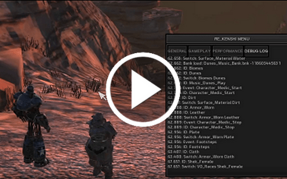

# Kenshi-MOD-ClassicFalloutMusic
[Nexus](https://www.nexusmods.com/kenshi/mods/1501) - [Steam Workshop](https://steamcommunity.com/sharedfiles/filedetails/?id=3348196865) - [GitHub](https://github.com/valsan-azerty-boi/Kenshi-MOD-ClassicFalloutMusic)
## What does this mod do ?
This mod replaces Kenshi's background music with themes from classic Fallout games (1, 2 and Tactics).

<iframe src="https://raw.githubusercontent.com/valsan-azerty-boi/Kenshi-MOD-ClassicFalloutMusic/refs/heads/master/images/mod-demo.mp4" width="400" frameBorder="0" allowFullScreen></iframe>

## Mod Requirements/Dependencies:
- Kenshi (the game): [Steam](https://store.steampowered.com/app/233860/Kenshi)
- The RE_Kenshi mod: [Nexus](https://www.nexusmods.com/kenshi/mods/847) - [GitHub](https://github.com/BFrizzleFoShizzle/RE_Kenshi)

## How to install the mod
- 2 possible ways
    - Way 1: Download the mod on Nexus. Unpack the mod (folder "ClassicFalloutMusic" from the archive) into your "/Kenshi/mods" folder, the folder structure will be "/Kenshi/mods/ClassicFalloutMusic". Launch the game and don't forget to activate the mod in the mod list.
    - Way 2: Just install via Steam Workshop (you need RE_Kenshi too in this case). Launch the game and don't &forget to activate the mod in the mod list.

## Technical informations
Unlike other video games where sounds are easily moddable, replacing sound files in Kenshi is much more technical. This requires a bit of reverse engineering and log analysis, for example to find the correct audio bus and events.

Below, I offer quite a bit of technical information on how to manage the Wwise project to set up this kind of thing. The repository also contains the Wwise project itself that I used (minus the .wav/.wem audio files).

I think that with all the list of events below, it's already a good basis if you want to make your own background music replacement mod.

### Wwise infos
- Wwise v2014.1.3
- Audio bus is "Music Bus"
- Input 44k stereo .Wav
- Output Vorbis quality 6 .Wem
- Fade-in 10s
- Fade-out 5s

#### Soundbanks:
##### MT_Music_Bank
- Function: Main menu theme, replacement
- Events:
    - Boot_Up_Game: Play "City of Lost Angels"
    - Create_or_Load_Game, Pause_Game, Resume_Game: Stop "City of Lost Angels"
##### Dunes_Music_Bank
- Function: In game musics, replacement
- Events:
    - Enter_Ashlands_Day: Play "New Reno"
    - Enter_Ashlands_Night: Play "Redding"
    - Leave_Ashlands: Stop "New Reno" & "Redding"
    - Enter_Canyons_Day: Play "Tactics Main Menu"
    - Enter_Canyons_Night: Play "Tactics MNT env"
    - Leave_Canyons: Stop "Tactics Main Menu" & "Tactics MNT env"
    - Enter_Desert_Day: Play "Worldmap 2"
    - Enter_Desert_Night: Play "Worldmap 1"
    - Leave_Desert: Stop "Worldmap 1" & "Worldmap 2"
##### Savannah_Music_Bank
- Function: In game musics, replacement
- Events:
    - Enter_Plains_Day: Play "Arroyo"
    - Enter_Plains_Night: Play "Khans of New California"
    - Leave_Plains: Stop "Arroyo" & "Khans of New California"
    - Enter_Coast_Day: Play "Underground Troubles"
    - Enter_Coast_Night: Play "Vats of Goo"
    - Leave_Coast: Stop "Underground Troubles" & "Vats of Goo"
    - Enter_Boneyard_Day: Play "Metallic Monks"
    - Enter_Boneyard_Night: Play "Industrial Junk"
    - Leave_Boneyard: Stop "Metallic Monks" & "Industrial Junk"

##### Swamplands_Music_Bank
- Function: In game musics, replacement
- Events:
    - Enter_Swamplands_Day: Play "Second Chance"
    - Enter_Swamplands_Night: Play "Moribund World"
    - Leave_Swamplands: Stop "Second Chance" & "Moribund World"
    - Enter_Jungle_Day: Play "Radiation Storm"
    - Enter_Jungle_Night: Play "Modoc"
    - Leave_Jungle: Stop "Radiation Storm" & "Modoc"
##### Tarsands_Music_Bank
- Function: In game musics, replacement
- Events:
    - Enter_Tarsands_Day: Play "Flame of the Ancient World"
    - Enter_Tarsands_Night: Play "Acolytes of the Newgod"
    - Leave_Tarsands: Stop "Flame of the Ancient World" & "Acolytes of the Newgod"
    - Enter_Forest_Day: Play "Desert Wind"
    - Enter_Forest_Night: Play "City of the Dead"
    - Leave_Forest: Stop "Desert Wind" & "City of the Dead"

## Other useful links:
- [RE_Kenshi wiki](https://github.com/BFrizzleFoShizzle/RE_Kenshi/wiki/Using-RE_Kenshi-to-mod-sound-banks)
